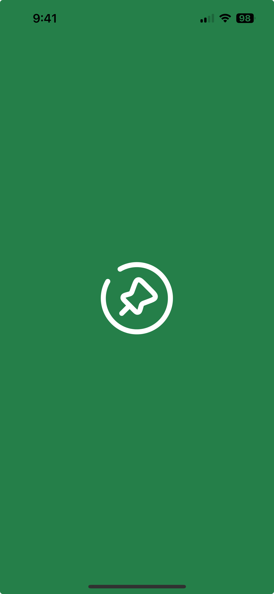
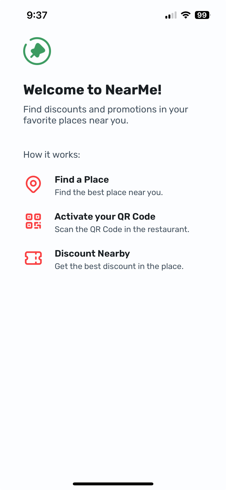

  <h1 align="center">NearMe!</h1>

<table align="center">
  <tr>
    <td align="center"></td>
    <td align="center"></td>
  </tr>
</table>

## 📝 Introduction:
NearMe! is a React Native application designed to discover the best discounts and promotions at your favorite places nearby. Save your money in just a few taps.

### How it works:
1. `Find a Place:` Explore nearby locations offering great deals.
2. `Activate Your QR Code:` Scan the restaurant's QR code to unlock exclusive discounts.
3. `Enjoy Your Savings:` Redeem the best deals effortlessly and make the most of your visit.

Simple as that!

<strong>Built with 💙 by [@Marcos Oliveira](https://www.linkedin.com/in/pgmarcosoliveira/)</strong>